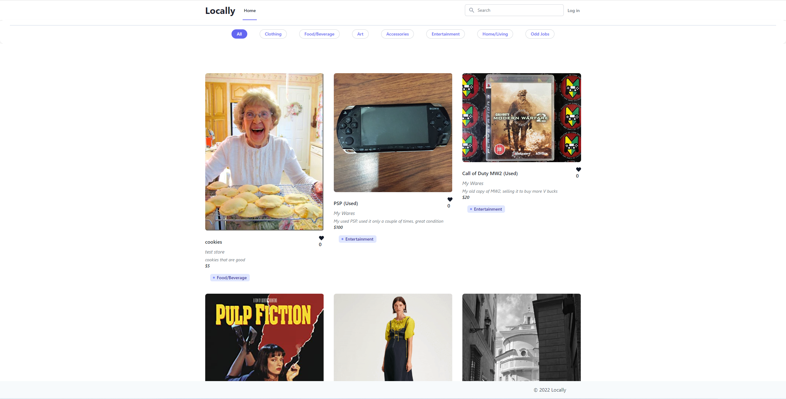
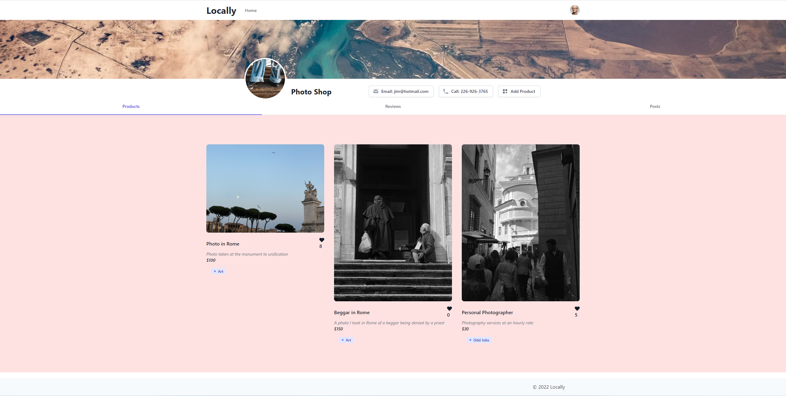
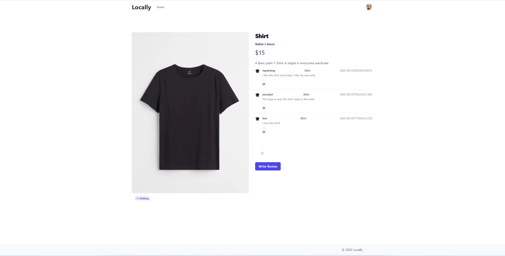

## Locally 
An E-commerce web application

  

  ## Table Of Contents
  - [Description](#description)
  - [Technologies](#technologies)
  - [Screenshots](#screenshots)
  - [Link (Deployed Application)](#link)
  - [License](#license)
  - [Repo](#repo)

## Description

  The Locally Application makes creating your own business a few clicks away, allowing users to view what people are selling in Toronto,
  While also making it easy for them to promote their own products.

  This is a MERN application that allows users to create an account with JWT authentication, search for products based on text and product tags,
  create a store and add products or services of their own, post reviews on products or post an ad or thought on their own profile, like products/posts/reviews
  all in an easy to use application to start their own business.

## Technologies
  HTML, CSS, JavaScript, MongoDB, Mongoose, Tailwind, Headless UI, React Icons, React, Cloudinary, Express, Bcrypt, Nodemon, GraphQL, Apollo, JWT & JWTDecode, Concurrently

## Screenshots

## Link

Click [here](https://dry-badlands-98649.herokuapp.com/) to visit the deployed link.

  
## License
This work is licensed under Creative Commons Attribution 3.0 Unported License. https://creativecommons.org/terms#8

## Repo

  This repo was created by [Benjamin Basic](https://github.com/BenBasic), [Rabia Saeed](https://github.com/zzzbia) and [Dylan Knight](https://github.com/DlonMusk) hosted at https://github.com/DlonMusk/Locally
  